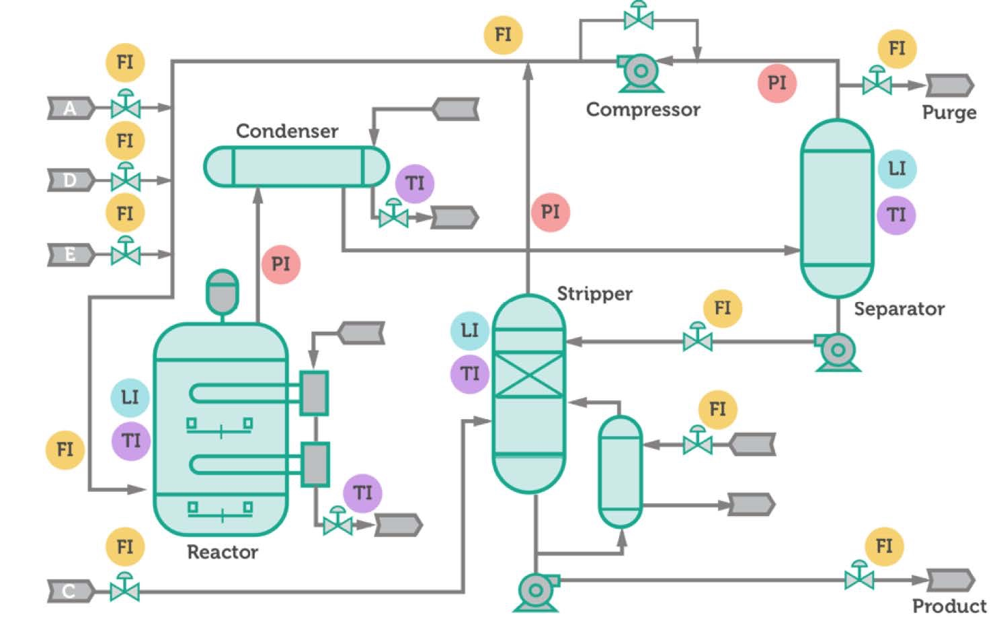

# TEPGuard: Real-Time Industrial Anomaly Detection with LLM Root Cause Analysis

TEPGuard is an end-to-end industrial anomaly detection system built on the Tennessee Eastman Process (TEP) dataset. The project simulates how real-world chemical plants monitor process variables, detect anomalies, and generate actionable insights for operators. The process is showon in the PFD below: 

 

The system mimics a production-grade workflow where process historian data (e.g., Aspen IP.21, DCS) arrives in small time-based batches, is processed through an ML pipeline, and enriched with LLM-based root cause explanations.

---

## What This Project Replicates

In real industrial environments:

- Data comes from systems like **DCS / IP.21 / OSI PI**
- Data arrives in **small time intervals (e.g., every 3 minutes)**
- Engineers monitor **hundreds of process variables simultaneously**
- Anomalies must be detected **early and explained clearly**

This project replicates that entire pipeline end-to-end using:

- Simulated batch ingestion
- LSTM Autoencoder anomaly detection
- Variable attribution
- LLM-based reasoning (Ollama + Mistral)
- Cloud-native architecture (AWS)

---

## Architecture Overview

The architecture follows a cloud-ready anomaly detection pattern:

1. Raw data batches are uploaded to Amazon S3 under `raw-batches/`.  
   These batches simulate real plant data coming from **DCS / IP.21 systems at ~3-minute intervals**.

2. AWS Lambda is triggered whenever a new batch lands in S3.

3. Lambda starts an ECS/Fargate task.

4. ECS runs the Python inference pipeline inside Docker.

5. The pipeline downloads:
   - the latest batch
   - the previous state buffer (for sequence continuity)

6. A rolling sequence is created for the LSTM autoencoder.

7. The autoencoder calculates reconstruction error.

8. If the error crosses the threshold, the point is marked as an anomaly.

9. Top contributing variables/tags are extracted.

10. Ollama (Mistral) reviews the anomaly and generates root-cause-style insights.

11. Results are written back to S3.

12. Streamlit reads S3 outputs and visualizes:
   - latest anomalies
   - top contributing tags
   - LLM root cause insights

---

## Data Simulation (Important)

Two scripts simulate real historian behavior:

### `create_mixed_stream.py`
- Mixes normal and faulty TEP data
- Simulates real plant conditions where anomalies occur intermittently

### `create_batches.py`
- Splits the mixed stream into small CSV batches
- Mimics **IP.21 / DCS data arriving every few minutes**

Together, these scripts replicate real-time process data ingestion.

---

## Model Training (Notebooks)

The `Notebooks/` folder contains:

### `autoencoder.ipynb`

This notebook is used to train the LSTM Autoencoder.

It includes:

- Data preprocessing and cleaning
- Feature scaling
- Sequence generation for LSTM
- Training on fault-free data
- Reconstruction error analysis
- Threshold selection
- Saving model artifacts

The model learns **normal plant behavior**.  
Any deviation (high reconstruction error) is flagged as an anomaly.

---

## Artifacts Folder

The `artifacts/` folder contains all required model components for inference:

### Included

- `feature_columns.pkl` → list of model input features
- `scaler.pkl` → fitted scaler used during training
- `config.json` → model parameters (sequence length, threshold, etc.)
- `variable_stats.json` → statistics for attribution

### Not Included

- Large model files (`.keras`, `.h5`) are excluded from GitHub
- Raw training data is excluded

These can be regenerated using the training notebook.

---

## Source Code (src/)

### `preprocess.py`
- Handles raw TEP data formatting
- Cleans and prepares data for downstream processing

### `create_mixed_stream.py`
- Simulates real plant behavior
- Combines normal + faulty data into a continuous stream

### `create_batches.py`
- Converts stream into small CSV batches
- Mimics real-time ingestion (like IP.21 / DCS)

### `inference.py`
- Core anomaly detection logic
- Loads trained model + scaler
- Creates sequences
- Calculates reconstruction error
- Flags anomalies

### `attribution.py`
- Identifies which variables contributed most to anomaly
- Outputs top contributing tags

### `llm_review.py`
- Sends anomaly + variables to Ollama (Mistral)
- Generates:
  - classification
  - affected area
  - reasoning
  - recommended action
  - confidence

### `pipeline_aws.py`
- End-to-end orchestration script
- Downloads batch from S3
- Runs inference + LLM review
- Uploads results back to S3

### `dashboard.py`
- Streamlit dashboard
- Displays:
  - anomaly table
  - top contributing tags
  - LLM insights
  - process flow diagram (PFD)

---

## AWS Layer

### `AWS/lambda_trigger.py`

- Triggered on new S3 batch upload
- Starts ECS task for processing

---

## Docker

### `Dockerfile`
- Builds container for inference pipeline

### `Dockerfile.ollama`
- Builds container for Ollama + Mistral model

---

## Sample Data

The `sample_data/` folder contains:
- Example batch files

Used for testing without full dataset

---

## Key Highlights

- Simulates real industrial data ingestion (IP.21 / DCS)
- Uses LSTM Autoencoder for anomaly detection
- Identifies top contributing variables
- Uses LLM (Mistral via Ollama) for explainability
- Fully AWS-integrated architecture (S3 + Lambda + ECS)
- Interactive Streamlit dashboard

---

## Future Improvements

- Integration with actual historian APIs
- Model retraining pipelines
- Alerting system (email/Slack)
- Advanced root cause graphs

---

## Author

Sourabh Rakesh Shinde
